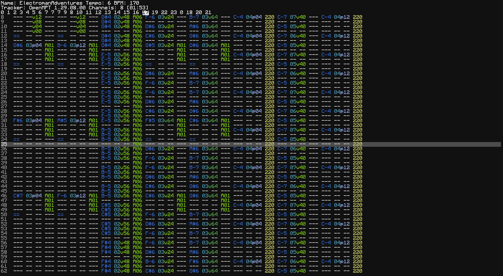

# tracc
An XM module tracker for ComputerCraft/CraftOS-PC. Sort of buggy, but it works.

This fork adds support for `speaker.playAudio`. It is not guaranteed that any other type of module works at the moment.

## Usage
To play a module, just run tracc with the path to the XM file. Press Q to close the tracker while playing.

## Making modules
### ComputerCraft 1.100+/CraftOS-PC v2.6.4+
CC: Tweaked 1.100.0 introduces the `speaker.playAudio` method, which allows playing real 8-bit audio on a speaker. This allows tracc to be able to play *any* XM module out there. In addition, there are no timing constraints because of how the audio queue events work, so modules with any BPM can play, even in Minecraft. The current version is a bit slow, however, and in-game it does not appear to be able to keep up with more than 8 channels at once. In addition, the current implementation of `speaker.playAudio` has a very large amount of latency, so the tracker on screen will not represent the audio currently playing at all.

### ComputerCraft (1.99.1 or earlier)
Modules for ComputerCraft with Minecraft sounds are much more limited than CraftOS-PC sound modules. Due to the one-off nature of sound in Minecraft, things like volume and pitch adjustments aren't possible. However, they have access to a much larger library of sounds than simple wave synthesis.

Because ComputerCraft limits sleep times to 50 ms increments, modules must be limited to 50 ms per tick. To accomplish this, your module should be set to 50 BPM and 2 ticks per row. (This may change in the future.)

A single tick can contain up to either 8 notes or 1 non-note sound for each speaker. (That is, for every tick in the song, each speaker may only have one sound or up to eight notes.) Speakers are automatically allocated, and if there aren't enough speakers for playback the program will error.

To add a sound to be played in the module, create a new instrument and sample pair, and set the sample's name to the name of the sound to play. For note block sounds, this can be the name of the note to play. For other sounds, this should be the namespaced ID of the sound to play (like would be in `/playsound`).

These are the valid note names:
* banjo
* basedrum
* bass
* bell
* bit
* chime
* cow_bell
* didgeridoo
* flute
* guitar
* harp
* hat
* iron_xylophone
* pling
* snare
* xylophone
