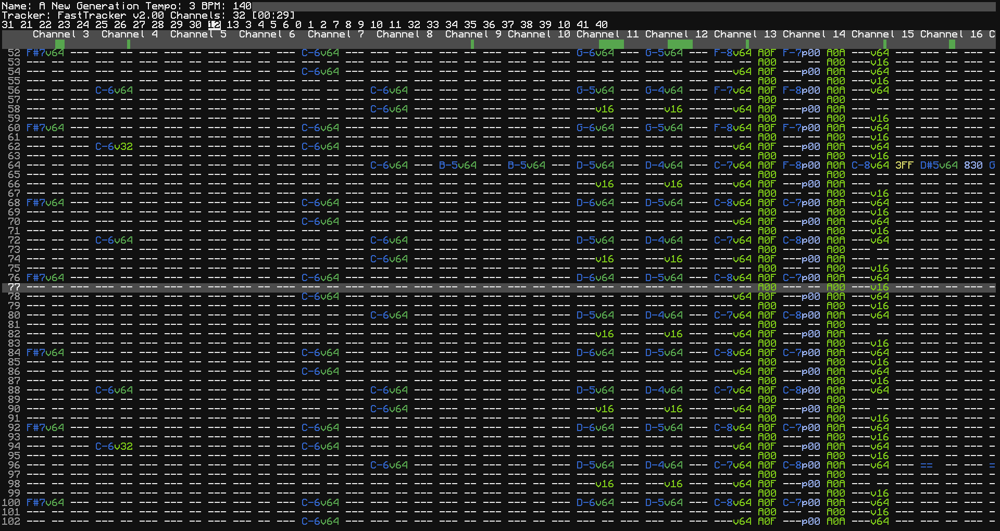

# tracc
An XM and more module tracker for ComputerCraft 1.100+.

This branch splits the core into a separate library, which can be embedded into other programs.

## Usage
To play a module, just run tracc with the path to the XM file. Press Q to close the tracker while playing.

You can seek through the file with the left and right arrow keys. The P key will pause the module, and the up/down arrow keys will move the cursor up/down. A and D will scroll the channels left and right respectively, allowing viewing the rest of the channels. Number keys 1-9/0 will toggle mute on channels 1-10.

Note that the cursor will be a couple of rows ahead, due to how ComputerCraft's audio works. CraftOS-PC will not have this issue, however.

## Module support
tracc can natively load pretty much any XM module file. It works best with modules with 8 channels or fewer, though larger modules are theoretically playable - normal CC is too slow to handle more channels. tracc can also load S3M and IT modules, but the effects are converted to XM internally, so they may not play correctly.

## Embedding
The `libtracc` module can be used to play modules inside other programs, with or without visual output.

- Call one of the `libtracc.read[XM|S3M|IT]File` functions to load a module. This takes a file handle, and returns a state object, which holds all of the information required for playback.
  - Use `libtracc.makeFile` to turn string data into a usable file handle.
- For simple playback, call `libtracc.play` with the state, optional volume, and the speakers to play on. This is a blocking function, and will return once the module finishes (which may be never if `state.loop` is true, which is the default).
  - Put this function in a coroutine manager, like `parallel` or [Taskmaster](https://gist.github.com/MCJack123/1678fb2c240052f1480b07e9053d4537), to play while other code is running.
- For more advanced playback, the `libtracc.tick` and `libtracc.row` functions can be used to process each tick/row sequentially. These take the state, whether to use stereo output, and optional tables to fill, and return tables with the left/mono, right (if requested), and VU information (which is mainly for use in tracc). The sample tables can be sent directly to `speaker.playAudio`.

The `minitracc.lua` program shows how to use `libtracc` in a simple program.
